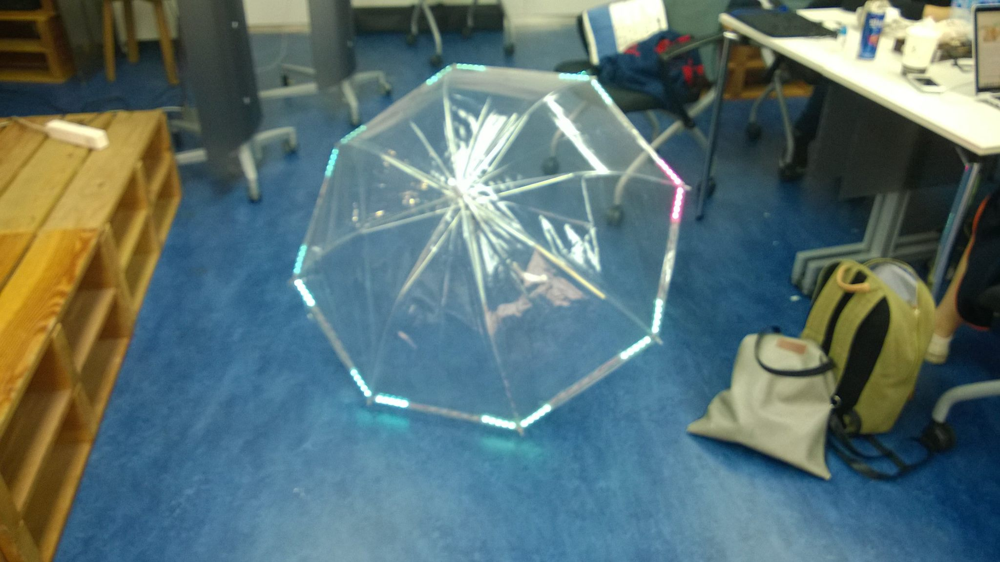

## Navirella☂

#### 출발지와 목적지를 설정하면 우산의 끝에 붙여진 LED를 통해 지금 가야할 방향을 알려주는 IoT 안드로이드 어플리케이션 입니다. 🤗

#### 진행시기
2015-08-31 With Camp 🥈

##### 완성된 우산의 모습

#### 주요 구현 사항 👩‍💻👨‍💻

~~~
1. Daum Map API를 연동하여 현재 가야하는 길의 방향을 구하고 

2. 블루투스 통신을 통해 우산에게 L(left), R(right), S(straight), A(arrived) 를 보냅니다.

3. 우산에서 아두이노를 통해 가야할 방향의 LED를 on 시켜줍니다.
~~~

#### 안드로이드에서 L, R, S, A 구하기 🧭

1. Daum Map Api에는 경로 상에 Turn Point를 제공한다.
2. 이를 현재 Turn Point와 Android GPS의 위도, 경도를 통해 Turn Point와의 거리를 구한다.

    ##### 간략 소스
    ~~~
        public static int checkCurrentLocation (double longitude, double latitude, double dd) {

        if (currentType == ACTION_START) {
            Log.i(TAG, "gogo: START");
            currentType = ACTION_STRAIGHT;
            pathInfo.addPointIndex();
            setCurTargetPoint(pathInfo.getCurTargetPoint());
            return sendCommandToUmbrella(currentType);
        } else if (currentType == ACTION_ARRIVED) {
            Log.i(TAG, "gogo: FIN");
            return sendCommandToUmbrella(currentType);
        } else {
            double distance = calDistance(new Point(longitude, latitude));
            
            if (distance < /*2.5E-4*/5) {
                if (currentType == ACTION_STRAIGHT) {
                    // 목표 지점에 도달한 시점.
                    currentType = curTargetPoint.getTurntype();
                }
                else {
                    // 회전을 아직 하지 않은 상태. 계속 회전하라고 명령
                }
            }
            else {
                if (currentType != ACTION_STRAIGHT) {
                    // 회전 포인트에서 회전하여 벗어남
                    // 새로운 목표 지점 설정
                    pathInfo.addPointIndex();
                    setCurTargetPoint(pathInfo.getCurTargetPoint());
                    currentType = ACTION_STRAIGHT;
                }
                else {
                    // 직진 도중. 계속 직진
                }
            }
            return sendCommandToUmbrella(currentType);
        }
    }
    ~~~

#### 아두이노에서 n번째 LED 구하기 ⭐️

1. 자이로 센서를 통해 현재 우산의 yaw 값을 구한다.
2. 안드로이드로 부터 받은 L, R, S, A 로부터 L, R은 -45, +45를 우산의 방향에 각각 더해준다.
3. 우산의 방향 * 8(LED 개수) / 360 을 하여 LED idx 값을 구한다.
